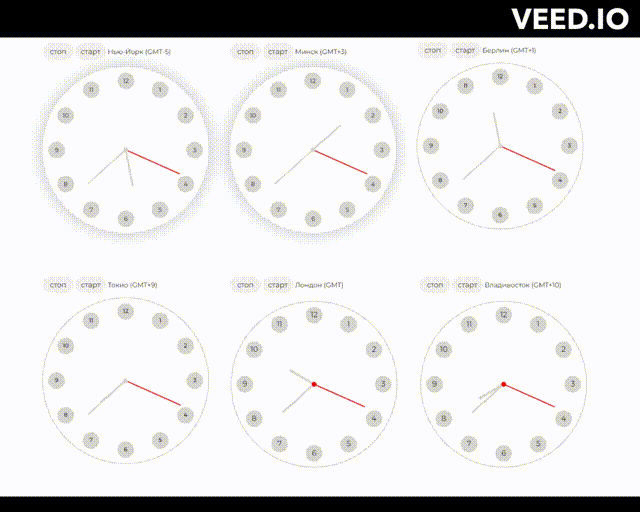

# Clock-MVC

Целью данного pet-проекта было практическое получение опыта в реализации концепции **MVC** (Model-View-Controller).

Информация о проекте:

1. MVC
2. 3 вида графики (DOM, SVG, Canvas)
3. Препроцессор SCSS
4. Циферблаты работают независимо друг от друга в **различных часовых поясах**

[Click to show](https://brainhdv.github.io/clock-MVC)
